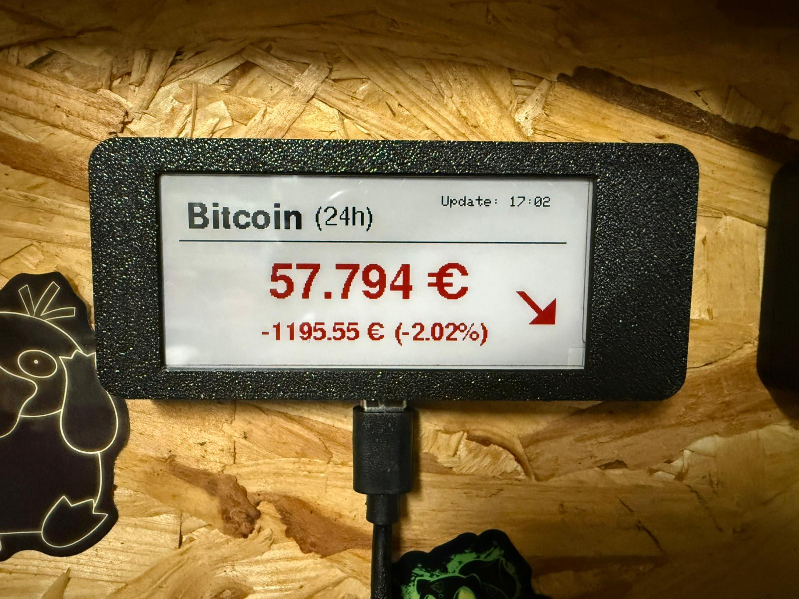
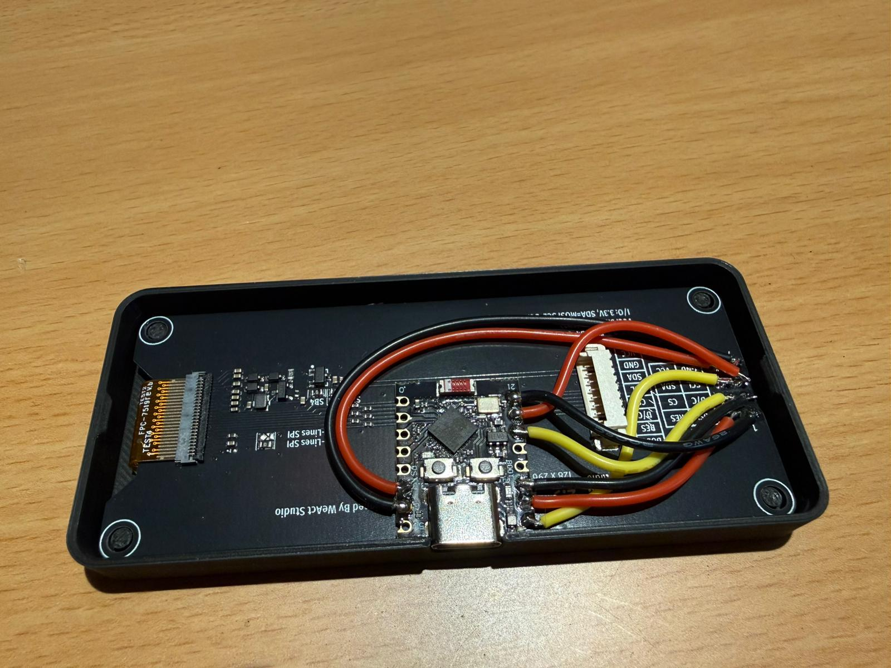

# ESP32_Bitcoin_Ticker

Ein minimalistischer Bitcoin-Preis-Ticker für ESP32 C3 Super Mini und ein WeAct 2.9-Zoll E-Paper Display (3-Farben).

## Features
- Holt Live-Daten von der Binance API.
- Zeigt den aktuellen Preis in EUR.
- Berechnet die 24h-Differenz (Prozent & Absolut).
- Nutzt Deep Sleep (aktualisiert alle 15 Minuten), um Strom zu sparen.

## Hardware
- ESP32 C3 Super Mini
- WEACT 2.9" E-Paper Display (BWR)

## Bibliotheken
Folgende Libraries müssen in der Arduino IDE installiert sein:
- `GxEPD2`
- `Adafruit_GFX`

## Software-Installation

### 1. Bibliotheken installieren
Damit der Code kompiliert, müssen folgende Bibliotheken in der Arduino IDE (über den Library Manager) installiert sein:

*   [**GxEPD2**](https://github.com) – Für die E-Paper Display Ansteuerung.
*   [**Adafruit GFX**](https://github.com) – Basis-Grafikbibliothek für Schriften und Formen.

### 2. Code herunterladen
Du kannst das komplette Projekt als ZIP-Datei herunterladen, um es direkt zu öffnen:

## Anschlussplan (Pinout)

Verbinde das E-Paper Display wie folgt mit deinem ESP32. Die Belegung im Code entspricht diesen Pins:

| E-Paper Pin | ESP32 Pin | Funktion |
| :--- | :--- | :--- |
| **BUSY** | GPIO 21 | Status-Abfrage |
| **CS** | GPIO 10 | Chip Select |
| **RST** | GPIO 6 | Reset |
| **DC** | GPIO 7 | Data/Command |
| **SCK** | GPIO 20 | SPI Clock |
| **MOSI** | GPIO 5 | SPI Data Out |
| **VCC** | 3.3V | Stromversorgung |
| **GND** | GND | Masse |

  
   
  <em>Vorderseite des Tickers</em>
    
  
   
  <em>Verkabelung des ESP32</em>

> **Hinweis:** Da das Display über SPI kommuniziert, achte darauf, dass die Kabelverbindungen fest sitzen, um Grafikfehler zu vermeiden.

## Lizenz

Dieses Projekt ist unter der CC BY-NC 4.0 Lizenz veröffentlicht.
